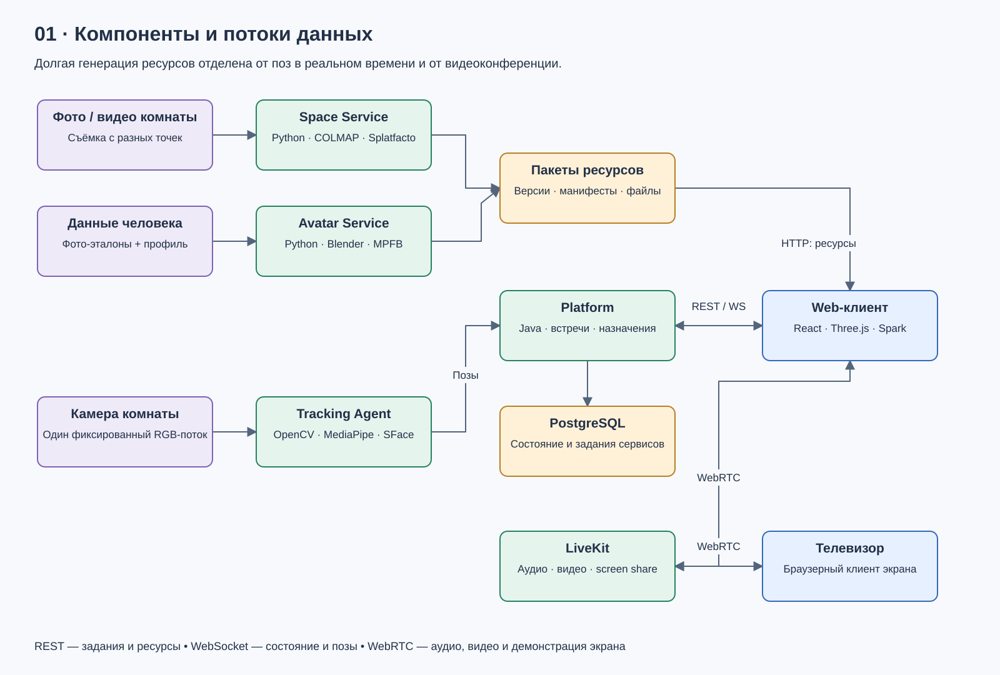

# Схемы архитектуры

[Открыть редактируемый файл architecture.drawio](architecture.drawio) в diagrams.net / draw.io через **File → Open from → Device**. Документ содержит пять страниц; элементы и соединения редактируются независимо. Файл не требует внешних картинок или сервисов.

| Страница | SVG-превью | Содержание |
|---|---|---|
| 01 | [Компоненты](components.svg) | Сервисы и разделение файлов, поз и медиа |
| 02 | [Размещение](deployment.svg) | Локальный компьютер и границы окружений |
| 03 | [Генерация](generation.svg) | Задание, проверенный пакет и публикация |
| 04 | [Трекинг](tracking.svg) | Калибровка, поза, временный трек и личность |
| 05 | [Конференция](conference.svg) | Общие медиапотоки физического и виртуального экранов |



Схемы показывают проектируемую систему, не состояние реализации. Полные требования и ограничения находятся в [общем дизайне](../superpowers/specs/2026-09-23-digital-room-design.md); схема намеренно не отображает каждый служебный запрос.

## Обновление

Исходные определения страниц находятся в [render_diagrams.py](render_diagrams.py). Для согласованного обновления draw.io и SVG изменить определения и выполнить из корня репозитория:

```powershell
py -3 docs/architecture/render_diagrams.py
```

Генерация XML и SVG использует только стандартную библиотеку Python. Повторный запуск перезаписывает созданные схемы. При ручном редактировании файла в draw.io экспортировать соответствующие SVG там же; такие изменения не возвращаются автоматически в определения Python.

Для локальной проверки раскладки доступны PNG из тех же определений. Это вспомогательный рендер, а не экспорт самим draw.io. Нужны Pillow и шрифты Segoe UI на Windows:

```powershell
py -3 docs/architecture/render_diagrams.py --png "$env:TEMP/digital-room-diagram-qa"
```
