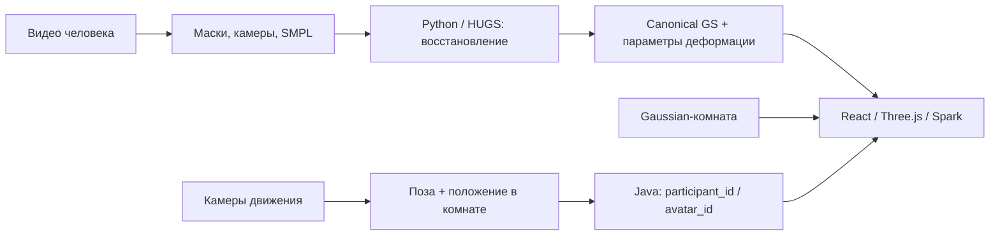

# Фотографический человек в Gaussian-комнате

Исследование от 25 сентября 2026. Уточнение приоритета: восстанавливать конкретного человека с его одеждой и волосами из фото/видео, затем управлять новыми движениями. MPFB сохраняется как рабочий прототип. Недостаток 6 ГБ VRAM не является основанием заранее отказаться от Gaussian-аватара. Эта рекомендация уточняет предыдущий выбор «mesh first»; запуск нейросетевого восстановления ещё не выполнен.

## Выбор

Для первого проверяемого эксперимента выбрать **HUGS**: персональный анимируемый Gaussian-аватар из видео, затем его совместное отображение с Gaussian-комнатой. Для более качественных складок одежды при наличии синхронных камер сравнить с **Animatable Gaussians**. Это выбор порядка проверки по устройству и доступности кода, а не утверждение, что HUGS визуально превосходит все альтернативы.

Одинаковое представление GS помогает сохранить фотографические детали, но само по себе не выравнивает освещение, экспозицию и качество съёмки. Нужен визуальный тест именно в комнате, со спины, сбоку и в новых позах. GS уже является 3D; превращение в полигональную поверхность для этой цели необязательно.

## Что действительно доступно

| Решение | Исходные данные и возможности | Роль в проекте / препятствия |
|---|---|---|
| [HUGS](https://github.com/apple/ml-hugs) | Монокулярное видео; отдельные режимы человек, сцена, оба вместе; опубликованы ссылки на данные и checkpoints | Первый эксперимент. Требуются SMPL, маски, позы и параметры камер. Не готовый browser SDK |
| [3DGS-Avatar](https://github.com/mikeqzy/3dgs-avatar-release) | Видео конкретного человека; деформируемые Gaussians; обучение и демонстрация новых поз | Альтернатива для сравнения внешности. В README новые произвольные последовательности поддержаны только для моделей ZJU-MoCap; собственный захват потребует адаптации |
| [Animatable Gaussians](https://github.com/lizhe00/AnimatableGaussians) | Многокамерные данные, маски, калибровка, SMPL-X; сеть предсказывает зависимые от позы Gaussian-карты | Приоритет для следующего сравнения качества одежды. Опубликованы код и ссылки на модели; существенно сложнее захват и перенос сети в браузер |
| [HAHA](https://github.com/david-svitov/HAHA) | Монокулярное видео, SMPL-X; текстурированный mesh вместе с Gaussians для волос и одежды | Запасной вариант уменьшения стоимости отображения. Это восстановленная фотографическая внешность, а не одноцветный MPFB |
| [LHM++](https://github.com/aigc3d/LHM-plusplus) | Одна или несколько фотографий, быстрое предсказание анимируемого человека | Удобен для регистрации человека, но сейчас не первый кандидат для независимого GS-рендера: доступность подходящих весов и разница neural renderer / raw GS требуют проверки |

HUGS выбран также по результату чтения [реализации](https://github.com/apple/ml-hugs/blob/main/hugs/models/hugs_trimlp.py): `canon_forward()` вычисляет внешний вид и параметры привязки, `forward_test()` принимает новую позу и выдаёт положения, ориентации, масштабы, прозрачность и SH Gaussians. Это конкретная точка подключения экспортера. Перенос ещё не реализован; его корректность нужно сравнить с исходным Python-рендером.

У HUGS отдельная лицензия Apple; у 3DGS-Avatar MIT распространяется лишь на перечисленные части, остальное наследует условия исходного 3DGS. SMPL/SMPL-X и наборы данных имеют собственные условия и процесс получения. Наличие бесплатного кода не означает свободное распространение всех моделей. Источники: [HUGS LICENSE](https://github.com/apple/ml-hugs/blob/main/LICENSE), [3DGS-Avatar README](https://github.com/mikeqzy/3dgs-avatar-release#license).

## Проверка LHM++ и локального оборудования

- `nvidia-smi`: RTX 2060, 6144 MiB всего, 4613 MiB свободно на момент проверки; драйвер 591.86. Это измерение доступной памяти, не тест нейросети.
- Docker работает в Linux-режиме; в WSL зарегистрирован `docker-desktop`. CUDA/PyTorch внутри исследовательского контейнера пока не проверены.
- В [таблице LHM++](https://github.com/aigc3d/LHM-plusplus#model-specifications) указано 7,3–8 ГБ. Для двух вариантов с raw GS экспортом — 8 ГБ. Это заявленные требования, не измерение на RTX 2060.
- Прямой анонимный запрос Hugging Face API: `3DAIGC/LHMPP-700M` доступен и содержит `model.safetensors`; `LHMPP-700M-PixelShuffle`, `LHMPP-700M-SMPLX-FREE`, `LHMPPS-700M` возвращают HTTP 401. Это не доказывает отсутствие закрытых весов, но не позволяет воспроизвести их анонимную загрузку.
- [Allowlist экспортера](https://github.com/aigc3d/LHM-plusplus/blob/main/core/utils/model_card.py) допускает только PixelShuffle и SMPLX-FREE. Обычные доступные веса нельзя считать взаимозаменяемыми. README отдельно сообщает, что публикация весов PixelShuffle ожидается.
- [PLY exporter](https://github.com/aigc3d/LHM-plusplus/blob/main/scripts/inference/to_gs_ply.py) сохраняет T-позу или одну заданную позу. Просмотр такого PLY работает обычным способом; произвольная анимация требует сохранения модели деформации.

Для HUGS не установлена подтверждённая минимальная VRAM. Следует измерять отдельно загрузку checkpoint, анимацию, обучение и совместный рендер комнаты. Более мощная GPU для обучения не обязательно потребуется браузерному клиенту.

## Как связать с комнатой

Предлагаемый пакет: canonical splats, модель скелета, параметры формы, веса привязки, корректировки позы, преобразование координат и версия. Только поля, реально нужные выбранной модели; обычный PLY сохраняется как статический preview.

[Spark](https://sparkjs.dev/docs/splat-mesh/) даёт Three.js-рендер и SplatSkinning. Однако его dual-quaternion skinning не равен HUGS linear blend skinning с корректировками SMPL. Для сохранения внешности нужно воспроизвести исходные вычисления либо измерить потери упрощения. Нельзя обещать подключение checkpoint одним вызовом загрузчика.

Первый тест интеграции: экспортировать несколько поз из Python в GS и сравнить браузерный кадр с эталоном, включая масштаб и ориентацию Gaussians, SH и прозрачность. Затем переносить деформацию для произвольных поз. Последовательность готовых PLY подходит для диагностики, но не заменяет управление человеком в реальном времени.

Если перенос модели окажется слишком тяжёлым, запасной путь — серверный рендер **всей сцены** с передачей через WebRTC. Простое видео человека поверх комнаты нарушит глубину и свободный обзор. Серверный путь потребует отдельного ракурса для каждого независимого зрителя.

Привязка личности остаётся `participant_id → avatar_id/version`; камерный `track_id` временный. Поза физического участника и клавиатура удалённого участника — отдельные источники. Камеры калибруются в общую систему координат комнаты. Геометрия пола/стен нужна для столкновений независимо от Gaussian-внешности.

## Захват собственного человека

Практическая стартовая рекомендация, не гарантированный рецепт авторов: короткое видео 30–60 секунд в ровном неизменном свете, полный рост, видны лицо, спина и боковые стороны; руки отделены от корпуса, умеренные движения. Отдельные крупные планы лица полезны, но их использование зависит от подготовки данных конкретного метода. Не менять одежду между кадрами.

Для монокулярного пути выбирать кадры по покрытию ракурсов, а не только по количеству. Необозримые участки не восстановятся достоверно от множества почти одинаковых кадров. Обычная фотограмметрия предполагает неподвижную поверхность; анимируемый человек требует оценки поз и приведения наблюдений к общей форме.

Если нужны достоверные складки при движении, лучше синхронные видео нескольких откалиброванных камер. Последовательный обход человеком с телефоном не эквивалентен одновременной многокамерной съёмке. [Animatable Gaussians описывает формат собственных данных](https://github.com/lizhe00/AnimatableGaussians/blob/master/gen_data/GEN_DATA.md).

## Порядок эксперимента на текущей GPU

1. Изолированное Linux/CUDA-окружение; проверить доступ RTX 2060 из PyTorch. MPFB и его зависимости не менять.
2. Получить SMPL установленным авторами способом и один готовый HUGS checkpoint с тестовыми данными. Сначала выполнить исходный inference, а не начинать с обучения и портирования одновременно.
3. Измерить пиковую VRAM и время кадра одного аватара. При OOM снижать разрешение рендера; загружать данные порциями. Проверить, не поднимает ли inference ненужное состояние оптимизатора.
4. Если inference проходит, запустить короткое обучение одного человека, затем полноценное. Контролировать рост числа Gaussians. В исходной конфигурации batch уже равен 1: совет «уменьшить batch» тут не помогает. Уменьшение числа итераций сокращает время, но не гарантирует уменьшения пиковой памяти.
5. Проверить на отложенных кадрах узнаваемость, волосы, одежду и новые позы. Затем — рядом с комнатой, включая проход за мебелью. Цель 30 FPS для итогового сценария является критерием проверки, а не полученным результатом.
6. При подтверждённом OOM сохранить конфигурацию и измерение, затем перенести тот же эксперимент на GPU с большей памятью. RAM/offload помогают только при поддержке конкретными операциями; CUDA-расширения не начинают автоматически использовать системную RAM.

На текущем этапе выполнены анализ исходников, проверка доступности весов LHM++ и оборудования. HUGS/Animatable Gaussians не установлены и не запущены. SMPL-файлы и собственная съёмка пользователя не предоставлены; требуется получение моделей с сайта автора для воспроизводимого HUGS inference. Поэтому здесь нет утверждения о фотореализме, FPS или успешном запуске на 6 ГБ.

## Продолжение реализации — 26 сентября 2026

Добавлен отдельный CLI `avatar_service.capture`: принимает видео или фото и атомарно
публикует нормализованные кадры с SHA256. Исходники не меняются. Выход помечается
`frames_only`, а не готовой реконструкцией. Запуск HUGS вынесен в отдельный
Linux/CUDA image; команды находятся в `services/avatar/gaussian/README.md`.

Проверка реальных артефактов уточнила предыдущие выводы:
- Из официальных архивов загружены данные и checkpoint только для `lab`.
- Для полного исходного evaluate/train отсутствуют `SMPL_NEUTRAL.pkl` и AMASS
  `SFU/0008/0008_ChaCha001_poses.npz`. AMASS загружается конструктором trainer,
  поэтому нужен не только при явном запуске анимации.
- В конфигурации авторского checkpoint осталось имя `hugs_triplane`, тогда как
  текущий код выбирает `hugs_trimlp`. Обвязка переводит имя при evaluation.
- Релизная конфигурация содержит шесть сцен; `--cfg_id 0` необходим для одного
  запуска, даже при переданном `dataset.seq=lab`.
- `--steps 100` не ограничивает предварительные 7000 шагов инициализации.
- Найден отдельный способ проверить каноническую внешность опубликованного
  checkpoint: его точки и декодеры позволяют вызвать исходный `canon_forward`
  без создания SMPL. Это отдельный эксперимент, не проверка новых поз.

Результаты фактических GPU-запусков и оставшиеся ограничения записываются в
`docs/superpowers/plans/2026-09-25-gaussian-avatar-experiment.md`.

### ??????? ???????? ????????? ?? RTX 2060

???????????? ????????? ???????????? ??????? `lab` ??????????? ????? ????????
`canon_forward` ? CUDA rasterizer. ????????? ??????? ???????????? ????? ???????
???????????? ???????. ?????????: 531 701 Gaussian, ?????? ??????? 512?512,
??????????? PLY. ??? PyTorch: 1,11 ??? allocated / 1,46 ??? reserved; ??? ??
?????? ?????? ???????? ? ?? ????????? ????????/????????. ????? ??????, CUDA
????????????? ????????. ??????????? ???????: `avatar_service.hugs_preview`
? ??????????, ??. README Gaussian-????????????.

????????? ? `.runtime/hugs-output/canonical-cli`: `view-0.png` ... `view-3.png`,
`canonical.ply`, `report.json`, `verification.json`. ??????????? ???????????:
??????, ?????? ? ???? ????? ??????????????? ??????, ?? ???? ???????? ? ?????????
?????????. ??? ??????? ?? ??????? ???????. ?? ??????????? ?????? ????????? ???
?? ???????. ????????? ????? ??? ???????? ????????? ?? SMPL/AMASS; canonical
preview ??????? ?????? ???????? ??? ???? ?????????? ?????? ????????????? SMPL,
?? ???????? ?????? ????????.
